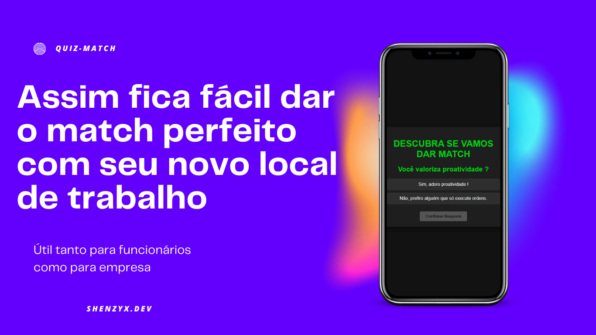

  

# QUIZ-MATCH
Bem-vindo ao QUIZ-MATCH ! 🚀

O QUIZ-MATCH é um quiz interativo que ajuda a entender como seus valores e preferências se alinham com os de outra pessoa. Ideal para quem está buscando entender melhor como alguém se encaixa em aspectos importantes do trabalho e da vida profissional. Se você valoriza a proatividade, a comunicação, a inovação e outros aspectos fundamentais, esse quiz vai te ajudar a encontrar o “match” perfeito! 💼❤️

O que é o QUIZ-MATCH?
O QUIZ-MATCH é uma ferramenta para responder perguntas rápidas sobre como você enxerga valores fundamentais no ambiente de trabalho. Com base em suas respostas, você poderá visualizar um feedback personalizado, além de comparar sua visão com a de outra pessoa. O resultado? Um “match” que pode indicar como vocês podem trabalhar melhor juntos!

# Funcionalidades
Quiz interativo: responda a perguntas sobre valores no ambiente de trabalho e receba feedback baseado em suas respostas.

Feedback personalizado: Veja como suas escolhas se comparam com as expectativas do quiz.

Botão de contato no WhatsApp: Ao final do quiz, você pode compartilhar seus resultados e entrar em contato pelo WhatsApp para mais informações.

Interface simples e intuitiva: A navegação é super simples, e você verá as perguntas e respostas de forma clara.

# Tecnologias Usadas
HTML : Estruturação do conteúdo e layout da página.

CSS : Estilização e design do quiz.

JavaScript : Lógica do quiz, manipulação de eventos e feedback dinâmico.

API do WhatsApp : Para enviar um link de contato diretamente ao WhatsApp, caso você queira saber mais sobre o assunto.
